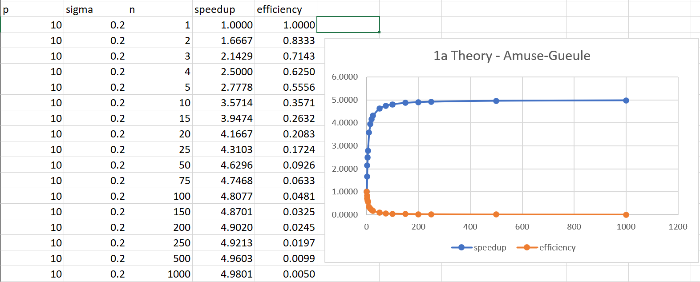
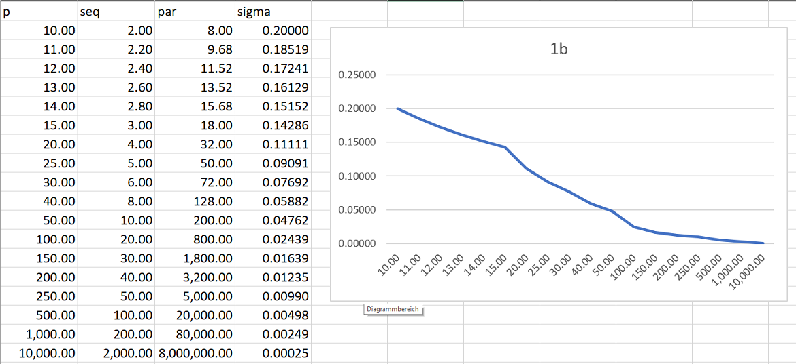
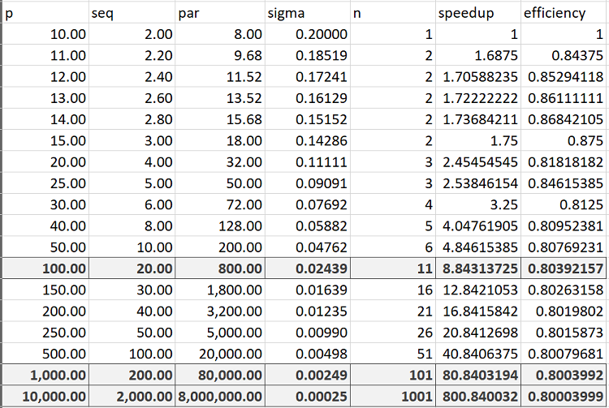
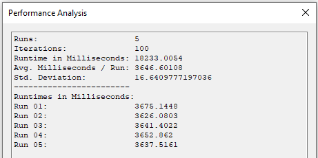
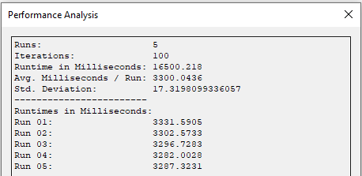
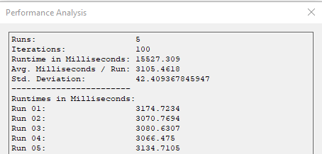
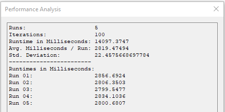

# Exercise 1

## System Configuration

|        CPU       |    Intel Core i7-7700K    |
|:-----------------|--------------------------:|
| CPU Base Speed   |                  4.20 GHz |
| CPU Boost Speed  |                  4.50 GHz |
| Memory Size      |                     16 GB |
| Memory Speed     |                  3000 MHz |
| Hard Drive       |              1 TB M.2 SSD |
| Operating System | Windows 10 Pro            |
| IDE              | Jetbrains Rider V2021.2.2 |

## Theory - Amuse-Gueule

### Speedup and Efficiency



<div style="page-break-after: always;"></div>

### Sigma with increasing problem size



### Efficiency with more processors



<div style="page-break-after: always;"></div>

## Wator World

### Review

While WinForms is still supported by Microsoft, it is quite old technology and should not be used anymore. It also makes it harder to port the Application to other operating systems.

The Code suffers from issues with readability and efficiency in quite a few spots. The GetNeighbour-Method is one of the worst offenders for that. The method should extract some functionality (like looking at neighbouring cells) into another function.

General Settings should not be hardcoded, they could be imported from a settings file.

### Improvements

Baseline Performance:



#### Optimization 1

Points required for the GetNeighbour-Method are allocated with every call. This has been reworked to only allocate the array once and reuse it for every call. **Speedup: 1.1**.



<div style="page-break-after: always;"></div>

```c#
private Point[] neighbors = new Point[4];

// find all neighboring cells of the given position and type
public Point[] GetNeighbors(Type type, Point position) {
    //Point[] neighbors = new Point[4];
    int neighborIndex = 0;
    int i, j;

    // look north
    i = position.X;
    j = (position.Y + Height - 1) % Height;
    if ((type == null) && (Grid[j * Width + i] == null)) {
        neighbors[neighborIndex] = new Point(i, j);
        neighborIndex++;
    } else if ((type != null) && (type.IsInstanceOfType(Grid[j * Width + i]))) {
        if ((Grid[j * Width + i] != null) && (!Grid[j * Width + i].Moved)) {  
            // ignore animals moved in the current iteration
            neighbors[neighborIndex] = new Point(i, j);
            neighborIndex++;
        }
    }
    // look east
    i = (position.X + 1) % Width;
    j = position.Y;
    if ((type == null) && (Grid[j * Width + i] == null)) {
        neighbors[neighborIndex] = new Point(i, j);
        neighborIndex++;
    } else if ((type != null) && (type.IsInstanceOfType(Grid[j * Width + i]))) {
        if ((Grid[j * Width + i] != null) && (!Grid[j * Width + i].Moved)) {
            neighbors[neighborIndex] = new Point(i, j);
            neighborIndex++;
        }
    }
    // look south
    i = position.X;
    j = (position.Y + 1) % Height;
    if ((type == null) && (Grid[j * Width + i] == null)) {
        neighbors[neighborIndex] = new Point(i, j);
        neighborIndex++;
    } else if ((type != null) && (type.IsInstanceOfType(Grid[j * Width + i]))) {
        if ((Grid[j * Width + i] != null) && (!Grid[j * Width + i].Moved)) {
            neighbors[neighborIndex] = new Point(i, j);
            neighborIndex++;
        }
    }
    // look west
    i = (position.X + Width - 1) % Width;
    j = position.Y;
    if ((type == null) && (Grid[j * Width + i] == null)) {
        neighbors[neighborIndex] = new Point(i, j);
        neighborIndex++;

    } else if ((type != null) && (type.IsInstanceOfType(Grid[j * Width + i]))) {
        if ((Grid[j * Width + i] != null) && (!Grid[j * Width + i].Moved)) {
            neighbors[neighborIndex] = new Point(i, j);
            neighborIndex++;
        }
    }

    // create result array that only contains found cells
    Point[] result = new Point[neighborIndex];
    for (int x = 0; x < neighborIndex; x++)
        result[x] = neighbors[x];
    return result;
}
```

#### Optimization 2

Operations on a 2-Dimensional Array can be quite performance hungry, so both matrixes are replaced with an array. The index can be calculated using the width of the world. **Speedup: 1.06**.



```c#
private int[] randomMatrix;
public Animal[] Grid { get; private set; }

Grid = new Animal[Width * Height];

private void RandomizeMatrix(int[] matrix) {
    // perform Knuth shuffle (http://en.wikipedia.org/wiki/Fisher%E2%80%93Yates_shuffle)
    int temp, selectedRow, selectedCol;

    int row = 0;
    int col = 0;
    for (int i = 0; i < Height * Width; i++) {
        temp = matrix[row * Width + col];

        // select random element from remaining elements
        // already processed elements must not be chosen a second time
        selectedRow = random.Next(row, Height);
        if (selectedRow == row) selectedCol = random.Next(col, Width);
        // current row selected -> select from remaining columns
        else selectedCol = random.Next(Width);
        // new row selected -> select any column

        // swap
        matrix[row * Width + col] = matrix[selectedRow * Width + selectedCol];
        matrix[selectedRow * Width + selectedCol] = temp;

        // incremet col and row
        col++;
        if (col >= Width) { col = 0; row++; }
    }
}
```

#### Optimization 3

The RandomizeMatrix method uses an inefficient version of the Knuth shuffle. This has been replaced with the more effiecent version which brings the asymptotic runtime complexity from O(n^2) to O(n). **Speedup: 1.1**.



```c#
private void RandomizeMatrix(int[] matrix) {
    // perform Knuth shuffle (http://en.wikipedia.org/wiki/Fisher%E2%80%93Yates_shuffle)
    int temp;

    for (int i = 0; i < Height * Width; i++) {
        int j = random.Next(i, Height * Width);
        temp = matrix[i];
        matrix[i] = matrix[j];
        matrix[j] = temp;
    }
}
```