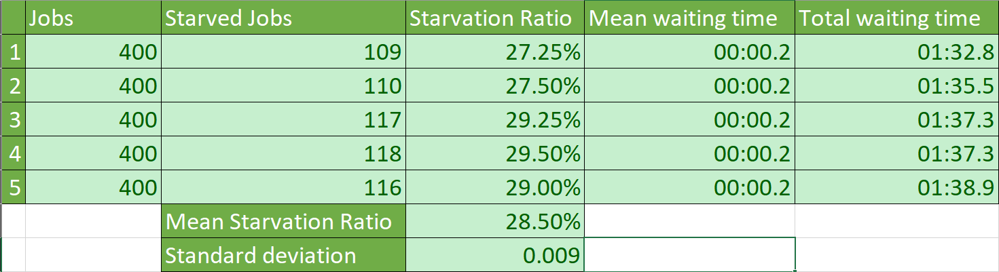

# VPS5 Exercise 2

## Race Conditions

A race condition occurs when two threads try to change the same variable. Since the threads have no way of communicating their changes to the other one, one will overwrite the changes the other made. In this example, the buffer writer will overwrite values that have not yet been read.

```csharp
class RaceCond {
    private const int N = 1000;
    private const int BUFFER_SIZE = 10;

    private double[] buffer;

    public void Run() {
        buffer = new double[BUFFER_SIZE];

        // start threads 
        var t1 = new Thread(Reader);
        var t2 = new Thread(Writer);
        t1.Start();
        t2.Start();

        // wait for threads 
        t1.Join();
        t2.Join();
    }

    private void Reader() {
        var readerIndex = 0;
        for (int i = 0; i < N; i++) {
            Console.WriteLine(buffer[readerIndex]);
            readerIndex = (readerIndex + 1) % BUFFER_SIZE;
        }
    }

    private void Writer() {
        var writerIndex = 0;
        for (int i = 0; i < N; i++) {
            buffer[writerIndex] = (double)i;
            writerIndex = (writerIndex + 1) % BUFFER_SIZE;
        }
    }
}
```

The above Race condition can be fixed with an AutoResetEvent. The Writer notifies the Reader whenever a variable is read and vice versa.

<div style="page-break-after: always;"></div>

```csharp
class RaceCond {
    private const int N = 1000;
    private const int BUFFER_SIZE = 10;

    private double[] buffer;
    private AutoResetEvent canWrite;
    private AutoResetEvent canRead;

    public void Run() {
        buffer = new double[BUFFER_SIZE];
        canWrite = new AutoResetEvent(true);
        canRead = new AutoResetEvent(false);

        // start threads 
        var t1 = new Thread(Reader);
        var t2 = new Thread(Writer);
        t1.Start();
        t2.Start();

        // wait for threads 
        t1.Join();
        t2.Join();
    }

    private void Reader() {
        var readerIndex = 0;
        for (int i = 0; i < N; i++) {
            canRead.WaitOne();
            Console.WriteLine(buffer[readerIndex]);
            canWrite.Set();
            readerIndex = (readerIndex + 1) % BUFFER_SIZE;
        }
    }

    private void Writer() {
        var writerIndex = 0;
        for (int i = 0; i < N; i++) {
            canWrite.WaitOne();
            buffer[writerIndex] = (double)i;
            canRead.Set();
            writerIndex = (writerIndex + 1) % BUFFER_SIZE;
        }
    }
}
```

## Synchronisation primitives

To synchronise the downloads, a semaphore with capacity 10 is used. When a download is complete, the semaphore releases the thread.

<div style="page-break-after: always;"></div>

```csharp
class LimitedConnectionsExample {
    private Semaphore semaphore;
    public LimitedConnectionsExample() {
        semaphore = new Semaphore(10, 10);
    }

    public void DownloadFilesAsync(IEnumerable<string> urls) {
        foreach (var url in urls) {
            semaphore.WaitOne();
            Thread t = new Thread(() => DownloadFile(url));
            t.Start();
            //semaphore.Release();
        }

        Console.WriteLine("Finished");
    }

    private void DownloadFile(object url) {
        // download and store file ... 
        Thread.Sleep(2000);
        Console.WriteLine($"File downloaded using Thread #{Thread.CurrentThread.ManagedThreadId} from url {url.ToString()}");
        semaphore.Release();
    }
}
```

For the synchronised method, all created threads are saved in a list. At the end of the function, all threads are joined back into the caller thread.

```csharp
public void DownloadFiles(IEnumerable<string> urls) {
    List<Thread> threads = new List<Thread>();

    foreach (var url in urls) {
        semaphore.WaitOne();
        Thread t = new Thread(() => DownloadFile(url));
        threads.Add(t);
        t.Start();
    }
    foreach (var t in threads) {
        t.Join();
    }        
}
```

## Toilet Simulation

The consumer Toilet and FiFoQueue were already implemented during the lecture and produce the following results.



A starvation rate of almost 30% is not great. This can be improved by using a priority queue. This means that new Jobs added to the queue will be inserted sorted by their WaitingTime.

```csharp
public static void InsertSorted(this IList<IJob> target, IJob newJob) {
    var index = 0;
    for (var i = 0; i < target.Count; i++) {
        if (target[i].WaitingTime < newJob.WaitingTime) {
            index++;
        } else {
            break;
        }
    }
    target.Insert(index, newJob);
}
```

This improved the starvation rate by about 18%.


