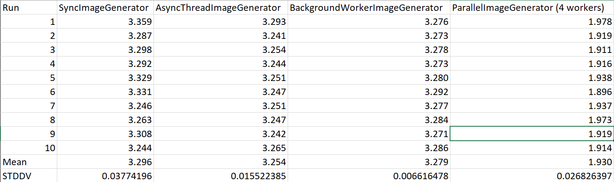

# Exercise 3

## Simple Mandelbrot Generator

The actual generation of the Mandelbrot set was already implemented during class and can be found in the file SyncImageGenerator.

## Mandelbrot Generator with Worker Threads

### Using Threads

This solution outsources the image generation to a separate thread. The generation can be cancelled via a CancellationToken. After a successful generation, the image is sent to the UI via an Event, similar to the SyncImageGenerator. This was developed during class as well.

### Using a BackgroundWorker

A BackgroundWorker is used to wrap the generator thread. It uses the two functions `Run()` and `OnImageGenerated()` to describe, what should happen when the worker runs and what happens after it finished. If a worker is already running and is called again, the running worker will be cancelled and a new worker is initialized. It uses the static function implemented in the SyncImageGenerator to generate the set.

```csharp
public class BackgroundWorkerImageGenerator : IImageGenerator {
    public event EventHandler<EventArgs<Tuple<Area, Bitmap, TimeSpan>>> ImageGenerated;
    private BackgroundWorker worker;

    public BackgroundWorkerImageGenerator() {
        InitBackgroundWorker();
    }

    private void InitBackgroundWorker() {
        worker = new BackgroundWorker();
        worker.DoWork += Run;
        worker.WorkerSupportsCancellation = true;
        worker.RunWorkerCompleted += OnImageGenerated;
    }

    private void Run(object sender, DoWorkEventArgs e) {
        Area area = (Area)e.Argument;
        Stopwatch sw = new Stopwatch();
        var worker = (BackgroundWorker)sender;
        var token = new CancellationToken(worker.CancellationPending);

        sw.Start();
        var bitmap = SyncImageGenerator.GenerateMandelbrotSet(area, token);
        sw.Stop();

        e.Result = new Tuple<Area, Bitmap, TimeSpan>(area, bitmap, sw.Elapsed);
    }

    private void OnImageGenerated(object sender, RunWorkerCompletedEventArgs e) {
        if (e.Cancelled) {
            return;
        }

        var handler = ImageGenerated;
        if (handler != null)
            handler(this, new EventArgs<Tuple<Area, Bitmap, TimeSpan>>(
                (Tuple<Area, Bitmap, TimeSpan>)e.Result
                ));
    }

    public void GenerateImage(Area area) {
        if (worker.IsBusy) {
            worker.CancelAsync();
            InitBackgroundWorker();
        }

        worker.RunWorkerAsync(area);
    }
}
```

## Partitioning the worker

The Image can be partitioned into columns. The amount of columns depends on the number of workers defined in the settings. Each column is generated by a thread that uses a CancellationToken from the same CancellationTokenSource. Calling the CancellationTokenSource.Cancel function will notify all connected CancellationTokens to stop working. After a column is done rendering it saves the image part in a Bitmap array and checks if the other parts are done already. If all parts are done, they are merged together and sent to the ImageGenerated event.

```csharp
public class ParallelImageGenerator : IImageGenerator {
    public event EventHandler<EventArgs<Tuple<Area, Bitmap, TimeSpan>>> ImageGenerated;

    private Bitmap[] imageParts;
    private CancellationTokenSource cancellationSource;

    public void GenerateImage(Area area) {
        cancellationSource?.Cancel(false);
        cancellationSource = new CancellationTokenSource();

        var cols = Settings.defaultSettings.Workers;
        var partWidth = area.Width / cols;

        imageParts = new Bitmap[cols];
        int colStart = 0;
        for (int i = 0; i < cols; i++) {
            int colEnd = colStart + partWidth;

            var t = new Thread(GenerateImagePart);
            t.Start(new Tuple<Area, int, int, int, CancellationToken>(area, colStart, colEnd, i, cancellationSource.Token));

            colStart += partWidth;
        }
    }

    private void GenerateImagePart(object obj) {
        var tuple = (Tuple<Area, int, int, int, CancellationToken>)obj;
        var sw = new Stopwatch();
        sw.Start();
        var image = GenerateImagePart(tuple.Item1, tuple.Item2, tuple.Item3, tuple.Item5);
        sw.Stop();

        OnImageGenerated(tuple.Item1, image, sw.Elapsed, tuple.Item4);
    }

    private static Bitmap GenerateImagePart(Area area, int colStart, int colEnd, CancellationToken token) {
        if (token.IsCancellationRequested) return null;

        var bitmap = new Bitmap(colEnd - colStart, area.Height);
        int maxIterations;
        double zBorder;
        double cReal, cImg, zReal, zImg, zNewReal, zNewImg;

        maxIterations = Settings.DefaultSettings.MaxIterations;
        zBorder = Settings.DefaultSettings.ZBorder * Settings.DefaultSettings.ZBorder;

        //insert code

        for (int i = colStart; i < colEnd; i++) {
            for (int j = 0; j < area.Height; j++) {
                // extract starting points based on the grid position
                cReal = area.MinReal + i * area.PixelWidth; 
                cImg = area.MinImg + j * area.PixelWidth;
                zReal = 0; // sequence variable = current value
                zImg = 0;

                int k = 0;
                while ((zReal * zReal + zImg * zImg < zBorder) && (k < maxIterations)) {
                    zNewReal = zReal * zReal - zImg * zImg + cReal;
                    zNewImg = 2 * zReal * zImg + cImg;
                    zReal = zNewReal;
                    zImg = zNewImg;
                    k++;
                }
                bitmap.SetPixel(i - colStart, j, ColorSchema.GetColor(k));
                if (token.IsCancellationRequested) return null;
            }
        }

        //end insert

        return bitmap;
    }

    private void OnImageGenerated(Area area, Bitmap image, TimeSpan elapsed, int col) {
        imageParts[col] = image;

        if (imageParts.Any(imagepart => imagepart == null)) return;

        var result = MergeBitmaps(area);

        var handler = ImageGenerated;
        if (handler != null)
            handler(this, new EventArgs<Tuple<Area, Bitmap, TimeSpan>>(
                new Tuple<Area, Bitmap, TimeSpan>(area, result, elapsed)
                ));
    }

    private Bitmap MergeBitmaps(Area area) {
        var result = new Bitmap(area.Width, area.Height);

        using (Graphics g = Graphics.FromImage(result)) {
            var colStart = 0;
            foreach (var part in imageParts) {
                g.DrawImage(part, colStart, 0);
                colStart += part.Width;
            }
        }

        return result;
    }
}
```

<div style="page-break-after: always;"></div>

## Measuring performance



As expected, the first three generators offer very similar performance, as the actual image generation does not really differ much. The asynchronous implementations seem to be more consistent and have a lower standard deviation.

Using 4 workers to generate the image helps it run almost 3x as fast. While one might expect a 4x increase in performance, that would not be realistic, as the parallel generator requires some overhead to create the threads and merge the image in the end.